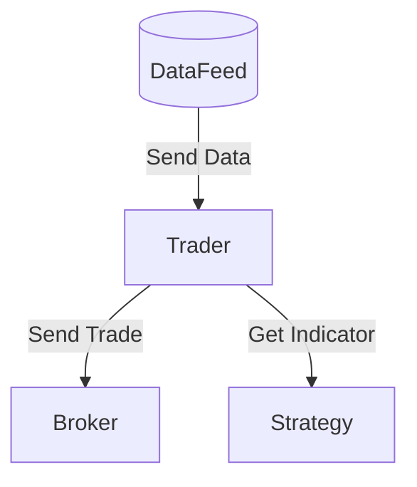
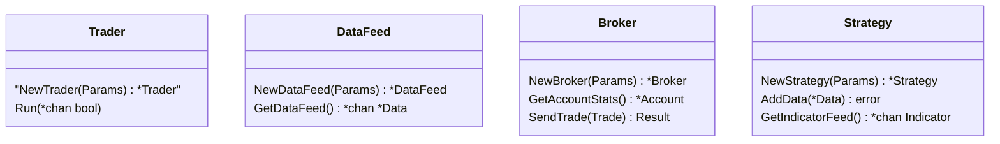

# Traedor High Level Design

## Traedor is designed to be a pluggable architecture where different implementations of each componenent can be swapped out to work in different environments. And example of this would be leveraging a paper trading broker and CSV datafeed for backtesting where a TDAmeritrade broker and datafeed module could be used to a live trading environment.

